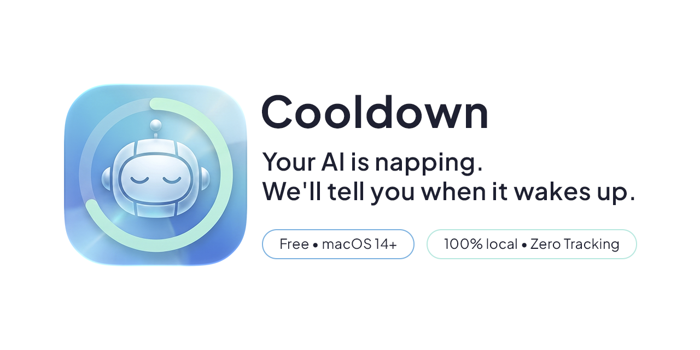
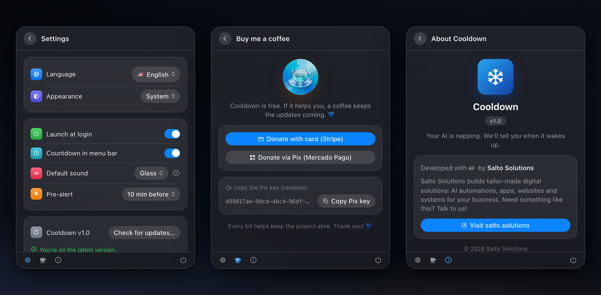

# ⏳ Cooldown — Timer de Limites de IA para Claude, ChatGPT e Gemini

**Sua IA está tirando uma soneca. A gente avisa quando ela acordar.**

O Cooldown é um app leve de barra de menus para macOS que te avisa — com som e notificação — no momento em que o limite de uso da sua IA reseta. Chega de adivinhar quando a janela de 5 horas do Claude acaba: configure uma vez, receba o alerta e volte ao trabalho.

*Read in [English](README.md).*



## Recursos

- ⏱️ **Múltiplos timers** — acompanhe várias contas e serviços ao mesmo tempo (ex.: "Claude — Trabalho" e "Claude — Pessoal")
- 🤖 **Presets de serviço** — Claude (5h), ChatGPT (3h), Gemini (24h) ou personalizado (nome + duração livres)
- 🔔 **Som + notificação** — escolha entre os sons do sistema com preview; o alerta dispara mesmo com o app fechado
- 🔁 **Re-arme em 1 clique** — a própria notificação tem o botão *"Comecei agora — novo ciclo"*, porque a janela só começa quando *você* manda a primeira mensagem
- ♻️ **Auto-repetição opcional** — por timer, para ciclos automáticos (desligado por padrão, pois pode desalinhar do reset real)
- 🪟 **Design Liquid Glass** — nativo no macOS 26+, fallback translúcido no macOS 14–15
- 🌗 **Aparência** — sistema / claro / escuro
- 🇧🇷🇺🇸 **Bilíngue** — português e inglês, com troca instantânea
- 🚀 **Iniciar com o sistema**, contagem na barra de menus, verificador de atualizações



## Privacidade

O Cooldown guarda tudo localmente no seu Mac (`UserDefaults`). Sem conta, sem telemetria — nenhum dado sai da sua máquina. A única requisição de rede é a checagem opcional de atualização no GitHub Releases.

## Instalação

### Homebrew (recomendado)

```bash
brew install --cask erickakyo/tap/cooldown
```

### Download manual

Baixe o `Cooldown-x.y.z.dmg` mais recente em [Releases](../../releases), arraste para Aplicativos e permita as notificações na primeira abertura.

> **Nota:** o Cooldown ainda não é notarizado pela Apple, então o macOS bloqueia a primeira abertura de uma cópia baixada ("A Apple não pôde verificar…"). Clique em **OK** (não em "Mover para o Lixo") e vá em **Ajustes do Sistema → Privacidade e Segurança**, role até o final e clique em **Abrir Mesmo Assim**. Ou, no Terminal:
> ```bash
> xattr -dr com.apple.quarantine /Applications/Cooldown.app
> ```

## Atualização

O Cooldown verifica novas versões automaticamente ao iniciar (e a cada 24 horas enquanto estiver aberto). Quando houver atualização, um banner laranja aparece no painel principal. Seus timers e configurações são sempre preservados — ficam nas preferências do macOS, não dentro do app.

Atualize pelo mesmo método que usou pra instalar:

- **Homebrew:** `brew upgrade --cask erickakyo/tap/cooldown`
- **Manual (DMG):** clique em **Baixar e Sair** no banner de atualização (o Cooldown fecha sozinho pro Finder aceitar a substituição) e arraste o novo Cooldown para Aplicativos. Se baixar por conta própria, saia do Cooldown antes (clique direito no ícone da barra → Sair). A primeira abertura após o download manual cai de novo no aviso do Gatekeeper — veja a nota em [Instalação](#instalação)
- **Do código-fonte:** no seu clone, `git pull && scripts/build.sh --install`

## Compilar do código-fonte

Requer macOS 14+ e Command Line Tools do Xcode (Xcode completo **não** é necessário):

```bash
git clone https://github.com/erickakyo/cooldown.git
cd cooldown
scripts/build.sh --install   # compila e instala em /Applications
```

Para desenvolvimento, `scripts/build.sh --run` compila e abre direto de `dist/`, sem instalar.

> Nota: a macro `@State` do SwiftUI não compila com as Command Line Tools no SDK do macOS 26, então as views usam `ObservableObject` + `@StateObject`. Detalhes de arquitetura no [CLAUDE.md](CLAUDE.md).

## Como funciona o re-arme

As janelas de uso das IAs (como as 5h do Claude) são *rolantes*: começam quando você manda a primeira mensagem, não num horário fixo. Por isso o Cooldown dispara **uma vez** e muda o timer para o estado "✅ Liberado!". A partir daí:

1. Toque em **"Comecei agora — novo ciclo"** na notificação (ou no app) no momento em que voltar a usar a IA — precisão máxima, um clique.
2. Ou ative a **auto-repetição** por timer, se preferir ciclos automáticos.
3. **Ajuste** qualquer timer em andamento a qualquer momento, caso o provedor resete a contagem globalmente.

## Apoie o projeto ☕

O Cooldown é gratuito. Se ele te livra da tela de "limite atingido", você pode pagar um café pelo botão de doação no app (cartão via Stripe, Pix via Mercado Pago).

---

Feito com ☕ pela [Salto Solutions](https://salto.solutions) — soluções digitais sob medida: automações com IA, apps, sites e sistemas. Precisa de algo assim? [Fale com a gente](https://salto.solutions).

© 2026 Salto Solutions. Todos os direitos reservados.
